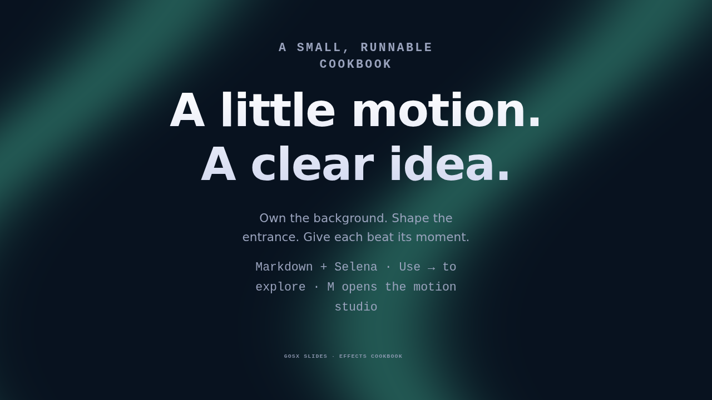
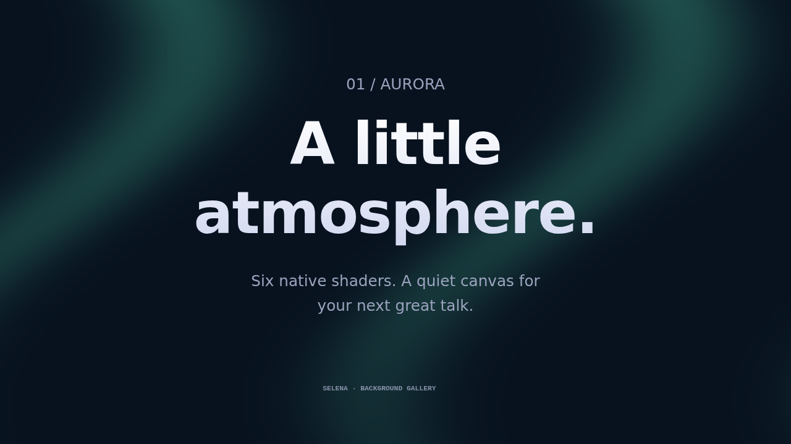
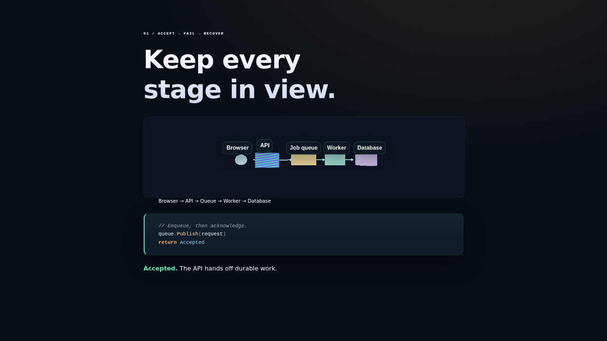

# gosx-slides

Build presentations from Markdown, with editable motion, Sirena diagrams,
Selena shaders and native 3D scenes on one seekable timeline. Author in the
browser, present live, and export the same story to the web, PDF or PowerPoint.

## See what you can make

These are captures of the runnable decks below. **The PDFs are already exported**;
you do not need to install anything to look through them.

| Effects cookbook | Selena backgrounds | Request, failure, recovery |
|---|---|---|
| [](docs/examples/effects-cookbook.pdf) | [](docs/examples/background-gallery.pdf) | [](docs/examples/request-recovery.pdf) |
| Custom shader, word entrances, sequenced cues and a shader shape. | Six ready-to-use backgrounds with distinct textures and palettes. | Scene3D actors, camera, shader material and code evolving together. |
| [Read the PDF](docs/examples/effects-cookbook.pdf) · [Source](examples/effects-cookbook) | [Read the PDF](docs/examples/background-gallery.pdf) · [Source](examples/background-gallery) | [Read the PDF](docs/examples/request-recovery.pdf) · [Source](examples/request-recovery) |

PDFs capture each click state as a still. Run the sources to see motion and
interactivity. [Browse the gallery and export recipes](docs/examples.md), or
[learn how the effects are authored](docs/shaders-and-motion.md).

## Make your first deck

Download your platform's archive from the
[latest release](https://github.com/M31-Labs/gosx-slides/releases/latest).
Keep the executable and its `runtime/` directory together. Ordinary serving and
live web exports then need neither Go nor Node.

```sh
slides templates
slides init my-talk --template technical-talk
slides serve my-talk --edit
```

Open the URL printed by the server. Use **E** to edit source, **M** for the
motion studio, **Backgrounds** to tune shaders, and **→** to advance.
Changes saved through the editor are validated, checked for concurrent edits,
and retain a recovery copy. Start with the architecture review or teaching
template when those better fit your talk.

To build from source, install Go 1.26 or newer:

```sh
git clone https://github.com/M31-Labs/gosx-slides.git
cd gosx-slides
go install ./cmd/slides
slides serve examples/effects-cookbook --edit
```

The gallery decks live in this source checkout. Source installations build and
cache the browser runtime with Go. `--watch` enables the component development
loop; the browser editor works with ordinary `--edit`.

## A small deck, with motion

Save this as `my-talk/deck.md`, then run `slides serve my-talk --edit`:

````md
---
title: A story in two beats
theme: aurora
scene: shader:aurora
shader-speed: 0.12
shader-strength: 0.25
---

```yaml
id: opening
cues: overview, idea
layout: center
```

# Make room for the idea.

:::motion {cue=idea preset=slide-up duration=600 replay=step}
One clear point, arriving when you need it.
:::
````

Link directly to the reveal with `#opening/idea`. Entrances replay on slide
entry by default; choose `replay=once` or `replay=step` explicitly when needed.
The motion studio edits duration, delay, easing and replay while you watch the
live slide. Reduced-motion preferences are respected.

## Make the background yours

The bundled presets are **aurora, silk, contours, waves, grid and spotlight**.
Use deck headmatter for a default, or a slide's leading YAML fence for an
override:

```yaml
scene: shader:silk
shader-ink: "#17101c"
shader-glow: "#e8b68b"
shader-speed: 0.12
shader-strength: 0.32
shader-scale: 1
```

To edit the shader itself, export one into your deck's `shaders/` directory:

```sh
mkdir -p my-talk/shaders
slides backgrounds source aurora --glow '#79a8ed' --speed 0.1 \
  --strength 0.3 > my-talk/shaders/aurora.sel
```

Set `scene: shaders/aurora.sel`. The file now owns the colors and timing; edit
its parameters or surface function. The same material can texture a shape:

```md
<Shader Src="shaders/aurora.sel" Shape="sphere" Label="Blue ribbon material" />
```

The [shader and motion cookbook](docs/shaders-and-motion.md) explains the full
Selena source, UV coordinates, time, color mixing, effect variations, split
text, cue sequencing and export behavior. CLI tuning flags require v0.11.0 or
newer; older releases can export the default shader and edit
its parameters, or download a tuned `.sel` from **Backgrounds**.

## Present and share

```sh
slides build my-talk --out dist                         # live web presentation
slides export my-talk --format pdf --capture --steps --out talk.pdf
slides export my-talk --format handout --out handout     # readable HTML
slides export my-talk --format pptx --editable --steps --out talk.pptx
```

PDF capture and PowerPoint need Chrome or Chromium; set `SLIDES_CHROME` if it
isn't discoverable on PATH. `--capture` preserves rendered shader/3D pixels;
`--steps` includes every click state. PDFs are stills. Use SPA for interaction,
or video export for motion. Editable PowerPoint supports native text, tables,
selected SVG shapes and charts, with captured fallbacks for other graphics.

Present with **P** for speaker view, **O** for overview/search, **V** for
reading, and **?** for shortcuts. Stable `#slide/cue` links restore story
states. Speaker notes are private unless explicitly included in a supported
export with `--notes`.

## Go deeper

| Want to… | Start here |
|---|---|
| Try a complete talk or download a PDF | [Example gallery](docs/examples.md) |
| Design backgrounds and vary motion effects | [Shader and motion cookbook](docs/shaders-and-motion.md) |
| Edit a multi-file project or use local agent tools | [Project authoring and VS Code](docs/project-authoring.md) |
| Explore reusable packs, semantic stories, recording, Office import, simulations or web page slides | [Capability reference](docs/reference.md) |
| Look up exact syntax, flags, limits and component contracts | [Author and agent reference](AGENTS.md) |
| Start with architecture, teaching or a technical talk | [Starter catalog](examples/starters/README.md) |

GoSX Slides is strongest at source-controlled technical storytelling: text,
diagrams, code and native graphics share cues and timing. It is not a full
PowerPoint layout importer; migration reports unsupported content rather than
claiming lossless conversion. Stateful simulations need explicit replay state.
[The reference](docs/reference.md) describes these boundaries in detail.

## Development

```sh
go test ./...
go vet ./...
npm ci --ignore-scripts
npm test
```

Browser/export checks require Chrome and ffmpeg/ffprobe; Playwright is a test
dependency, not an authoring requirement. CI also runs Go race tests on Linux,
macOS and Windows, plus Firefox/WebKit browser checks. See
[regenerating the gallery](docs/examples.md#maintaining-the-gallery) for one
command to refresh the published PDFs, screenshots and source hashes.
