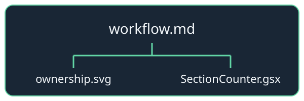

```yaml
layout: comparison
id: ownership
```

# One source, clear ownership

:::columns
:::col "AUTHOR SOURCE"
Each fragment keeps its own images and component definitions.


:::
:::col "LIVE CONTENT"
The island beside this file resolves from the fragment directory.

<SectionCounter Initial={2}/>

A deck-level `SectionCounter.gsx` can explicitly override it.
:::
:::

<!-- Includes expand for rendering. The source editor still saves only deck.md. -->
