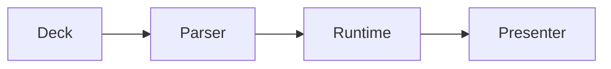

# gosx-slides

A deck runtime for the GoSX stack.

<Step n={1}>Authoring is markdown-shaped and presenter-aware. Current click: {$step}</Step>

<Metrics>
<Metric label="Runtime" value="Go" delta="no JS toolchain"/>
<Metric label="Presenter" value="SSE" delta="locked follow"/>
<Metric label="Export" value="SPA+" delta="notes and manifest"/>
</Metrics>

<Notes>
This deck exercises the current local runtime surface.
</Notes>

---
layout: center
---

## Run of show

<Agenda/>

<Notes>
Use this as a generated overview. It should update as slides are reordered.
</Notes>

---
layout: two-cols
clicks: 3
---

## Clicks as state

- Step content
- Stepped code
- Runtime surfaces

<Step n={2}>The click count can drive embeds.</Step>

::right::

```go {1-3|5|all}
package main

func main() {
    println("slides")
}
```

<Notes>
Use this slide to explain click-stepped code and how `$step` can be shared with embeds.
</Notes>

---
layout: center
clicks: 2
---

## Scene3D

<Scene3D/>

<Notes>
Advance one click to show the scene responding to the click signal.
</Notes>

---
layout: center
---

## Diagram



<Notes>
Static diagrams are deterministic today; interactive sirena diagrams remain Phase 4.
</Notes>

---
layout: center
---

## Built-ins

<Callout tone="gold">Built-ins render as typed presentation surfaces now: metrics, callouts, polls, timelines, code, diagrams, canvas, and scenes.</Callout>

<Poll question="Most useful v1 surface?" options="Presenter sync|Static export|Live embeds"/>

<Notes>
Use this slide to show that built-ins are normal deck content and still export.
</Notes>

---
layout: two-cols
---

## Runtime path

<Timeline items="Author deck.md|Render static lane|Drive click signal|Sync presenter state|Export artifacts"/>

::right::

<Metric label="Deep mode" value="on" delta="stateful authoring"/>

<Notes>
Talk through the local fallback lane and the future mdpp to GoSX island bridge.
</Notes>

---
layout: image-right
---

## Canvas

The canvas board is an engine-shaped placeholder that keeps the embed contract
visible before full GoSX engine lowering lands.

::image::

<Canvas/>

<Notes>
The canvas board is intentionally local for now; the upstream engine seam can replace it.
</Notes>

---
layout: quote
---

> The upstream bytecode hot-swap is still a core GoSX seam. The local runtime is ready to consume it.

<Notes>
Close with the boundary: this repo owns authoring and presenting; GoSX/mdpp own true bytecode hot-swap and AST lowering.
</Notes>
